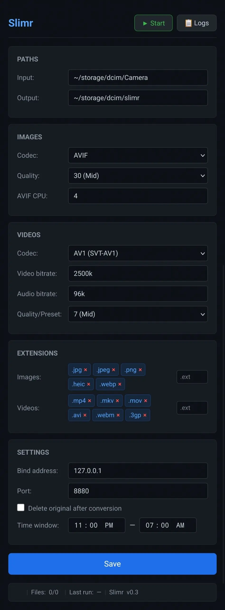

# Slimr

Automatic media compression for Android via Termux. Converts photos and videos in the background during a configurable time window, preserving all metadata.

---

## Installation

### Prerequisites

1. Install [Termux](https://f-droid.org/en/packages/com.termux/) from F-Droid (the Play Store version is outdated)
2. Open Termux and grant storage access:
   ```bash
   termux-setup-storage
   ```
3. Pull down the Termux notification shade and tap **"Acquire wakelock"** — this prevents Android from killing background processes
4. *(Optional)* Install [Termux:Boot](https://f-droid.org/en/packages/com.termux.boot/) from F-Droid to auto-start Slimr when the phone boots

### One-line install

```bash
curl -L https://raw.githubusercontent.com/procrastinando/slimr/master/install.sh | bash
```

### Manual install

```bash
pkg update && pkg install ffmpeg exiftool
mkdir -p ~/slimr-data
# Download the latest slimr_arm64 from GitHub Releases
chmod +x ~/slimr
```

### Uninstall

```bash
curl -L https://raw.githubusercontent.com/procrastinando/slimr/master/uninstall.sh | bash
```

---

## Usage

```bash
~/slimr
# Slimr running on http://127.0.0.1:8880
```

Open `http://127.0.0.1:8880` in your phone browser. You'll see the web UI where you can configure:

| Section | Options |
|---|---|
| Paths | Input directory (default: `~/storage/dcim/Camera`), Output directory (default: `~/storage/dcim/slimr`) |
| Images | Codec: AVIF / JPEG. Quality: High / Mid / Low. AVIF CPU usage (0–8) |
| Videos | Codec: HEVC Hardware / AV1 SVT-AV1 / HEVC x265. Video bitrate. Audio bitrate (Opus). Quality/Preset |
| Extensions | Editable lists of file extensions to scan for images and videos |
| Settings | Bind address (default: 127.0.0.1), Port (default: 8880), Delete original toggle, Time window |

### Workflow

1. Configure your settings and click **Save**
2. Press **▶ Start** — Slimr enters idle mode and waits for the time window
3. During the window, it scans for new files and converts them one by one
4. Press **📋 Logs** to see real-time progress
5. Press **⏹ Stop** to pause (finishes the current file first)

### Install as app (PWA)

In Chrome, tap the menu → **"Install Slimr"** (or "Add to Home Screen"). This opens full-screen with no browser UI, like a native app.

## Screenshot



---

## File locations

| Item | Path |
|---|---|
| Binary | `~/slimr` |
| Config | `~/slimr-data/config.json` |
| App log | `~/slimr-data/slimr.log` |
| Conversion log | `~/slimr-data/conversion.log` |
| Boot script | `~/.termux/boot/slimr` |

---

## Default settings

```json
{
  "input_path":          "~/storage/dcim/Camera",
  "output_path":         "~/storage/dcim/slimr",
  "bind_address":        "127.0.0.1",
  "port":                "8880",
  "image_codec":         "avif",
  "image_quality":       30,
  "avif_cpu":            4,
  "video_codec":         "hevc_mediacodec",
  "video_bitrate":       "3500k",
  "audio_codec":         "libopus",
  "audio_bitrate":       "96k",
  "video_quality":       "",
  "delete_original":     false,
  "window_start":        "23:00",
  "window_end":          "07:00",
  "image_extensions":    [".jpg", ".jpeg", ".png", ".heic", ".webp"],
  "video_extensions":    [".mp4", ".mkv", ".mov", ".avi", ".webm", ".3gp"]
}
```

---

# Technical Reference (for LLMs and contributors)

## Project structure

```
slimr/
├── main.go                       # Entry point, embed web UI, wire components
├── go.mod                        # Go module: slimr
├── install.sh                    # One-line installer
├── uninstall.sh                  # Cleanup script
├── .gitignore
├── logo.png                      # App icon
├── internal/
│   ├── config/
│   │   └── config.go             # Config struct, defaults, Load/Save JSON, merge, ExpandPaths, UnexpandPaths
│   ├── scanner/
│   │   └── scanner.go            # File discovery, extension filter, processed-file tracking (.processed.db)
│   ├── converter/
│   │   ├── converter.go          # Shared: Duration(), VideoBitrate(), ParseBitrate(), CopyFile(), MoveFile(), progress parsing
│   │   ├── image.go              # Image ffmpeg commands (AVIF libaom, JPEG mjpeg)
│   │   ├── video.go              # Video ffmpeg commands (hevc_mediacodec, libsvtav1, libx265)
│   │   └── metadata.go           # Exiftool metadata transfer (-tagsfromfile -all:all)
│   ├── scheduler/
│   │   └── scheduler.go          # Worker loop, start/stop, time-window check, SSE broadcasting
│   └── server/
│       ├── server.go             # HTTP mux, API handlers, config merge, file serving
│       └── sse.go                # SSE log streaming, LogBroadcaster, tailLogFile
└── web/
    ├── index.html                # SPA UI (PWA-capable)
    ├── style.css                 # Dark theme
    ├── app.js                    # Frontend logic, API calls, SSE client, toggle button
    ├── logo.png                  # Favicon + PWA icon
    ├── manifest.json             # PWA manifest (display: standalone)
    └── sw.js                     # Minimal service worker
```

## Build

```bash
# Native build
go build -o slimr .

# Cross-compile for Android (arm64)
GOOS=android GOARCH=arm64 go build -o slimr_arm64 .
```

No external Go dependencies — stdlib only.

## Architecture

```
Browser ←→ HTTP :8880 ←→ Server ←→ Scheduler ←→ Scanner + Converter
                              │            │
                          LogBroadcaster ──→ SSE (real-time logs to browser)
                              │
                          Config (JSON file on disk)
```

### Data flow per file

1. Scanner walks input directory via `os.ReadDir` (non-recursive, top-level only)
2. Filters by extension, skips 0-byte and hidden files
3. For each candidate: computes output path, checks if output already exists AND file is tracked in `.processed.db`
4. Converter builds ffmpeg command (image or video)
5. ffmpeg runs, stderr parsed for progress (video only)
6. Exiftool transfers all metadata from original to compressed file
7. If `delete_original`: removes original file
8. Scanner marks file as processed in `.processed.db` (JSON array)
9. Log line appended to `~/slimr-data/conversion.log`
10. SSE event broadcast to all connected browsers

## API endpoints

| Method | Path | Purpose |
|---|---|---|
| `GET` | `/` | Web UI |
| `GET` | `/api/config` | Read config (paths unexpanded for display) |
| `PUT` | `/api/config` | Partial update — merges non-zero fields into existing config, saves to disk, triggers `ReloadConfig()` |
| `POST` | `/api/start` | Start worker goroutine |
| `POST` | `/api/stop` | Signal stop (finishes current file, then exits loop) |
| `GET` | `/api/status` | `{running, state, current_file, files_total, files_done, last_run, in_window, version}` |
| `GET` | `/api/logs?tail=N` | Last N lines from conversion log |
| `GET` | `/api/logs/stream` | SSE stream (real-time log + progress events) |

### SSE event types

```json
{"type":"log",     "line":"02:08:17 > photo.jpg > 5.56s"}
{"type":"progress","file":"vid.mp4","elapsed":12.5,"total":300.7,"done":5,"total_files":136}
{"type":"status",  "state":"working","files_total":136,"files_done":5}
```

## Codec/parameter reference

### Image encoding

| Codec | ffmpeg command | Quality | Speed |
|---|---|---|---|
| AVIF (`libaom-av1`) | `-c:v libaom-av1 -still-picture 1 -cpu-used {N} -crf {Q}` | `-crf` 0–63 (20/high, 30/mid, 40/low) | `-cpu-used` 0–8 (2/slow, 4/mid, 6/fast) |
| JPEG (`mjpeg`) | `-q:v {Q}` | `-q:v` 2–31 (4/high, 8/mid, 16/low) | None (always fast) |

Always uses `-noautorotate` to prevent double rotation when metadata is transferred back.

### Video encoding

| Codec | ffmpeg command | Bitrate control | Speed parameter |
|---|---|---|---|
| HEVC Hardware (`hevc_mediacodec`) | `-hwaccel mediacodec -c:v hevc_mediacodec -bitrate_mode vbr -b:v {B}` | `-b:v` only (CQ mode not supported by Qualcomm) | None (GPU, ~1.4–1.9x real-time) |
| AV1 (`libsvtav1`) | `-c:v libsvtav1 -preset {P} -b:v {B}` | `-b:v` or `-crf` (mutually exclusive) | `-preset` 0–13 (4/slow, 7/mid, 10/fast) |
| HEVC Software (`libx265`) | `-c:v libx265 -preset {P} -crf {Q}` | `-crf` 0–51 (14/high, 28/mid, 42/low) | `-preset` ultrafast/medium/slow |

Audio: always `libopus` at configurable bitrate (default 96k).

## Key architectural decisions and gotchas

### 1. Termux storage access

Termux uses `~/storage/` which is a FUSE mount to `/storage/emulated/0/`. Go's `filepath.Walk` silently fails on this mount — the scanner uses `os.ReadDir` (single-level, non-recursive) instead. Subdirectories like `Thumbnail/` are skipped.

### 2. Tilde path handling

Config stores paths as `~/storage/...` for user readability. `ExpandPaths()` resolves `~` on load. `UnexpandPaths()` reverses for display in the API response. Paths set in constructor functions (before `ExpandPaths`) must handle the `~` prefix themselves (e.g., the `log()` function in scheduler.go).

### 3. No timezone database on Termux

Go's `time.Now().Zone()` returns UTC/0 on Termux because there is no `tzdata` package. The window check uses `date +%z` via `exec.Command` to detect the real UTC offset, then adds it to `time.Now()` to compute local hours.

### 4. Config reload pointer sharing

The server and scheduler must share the same `*Config` pointer so that UI changes propagate immediately. `ReloadConfig()` copies values into the existing pointer (`*s.cfg = *cfg`) rather than replacing it.

### 5. PUT config merge

The `PUT /api/config` endpoint receives a partial JSON payload. `mergeConfig()` only overwrites non-zero fields from the incoming config, preserving other existing values. Fields: empty string → don't overwrite; 0 int → don't overwrite; false bool → overwrite (because false is the safe default); nil slice → don't overwrite.

### 6. Processed file tracking

`.processed.db` is a JSON array stored in the output directory. Scanned files that already have output AND appear in this DB are skipped. This prevents re-processing after restarts.

### 7. Low-bitrate video skip

Before conversion, `ffprobe` probes the original video bitrate. If it's already below the target bitrate, Slimr copies (or moves) the file directly instead of re-encoding. This prevents making files larger.

### 8. Window crossing midnight

Windows like `23:00–07:00` cross midnight. The `inWindow()` function handles this by comparing minutes-since-midnight: if `endMinutes < startMinutes`, the window crosses midnight and the check becomes `nowMinutes >= startMinutes || nowMinutes < endMinutes`.

### 9. Mid-batch window exit

After each file is processed, the scheduler checks if it's still inside the window. If not, it logs a pause message and returns from the batch loop. The next iteration will resume when the window reopens.

### 10. Server bind address

Default is `127.0.0.1:8880` (localhost only). The user can change to `0.0.0.0:8880` to allow LAN access, but this is not recommended for security.

## Git history

```
a34e310 Use date +%z shell command to detect real timezone offset
be25f9c Fix window crossing midnight, config reload, mid-batch check, defaults
e6f2d77 Fix logs panel, skip low-bitrate videos, version footer, last-run, tilde paths
d24c866 Slimr v0.2: PWA install, single toggle, bind address, real-time logs
```
